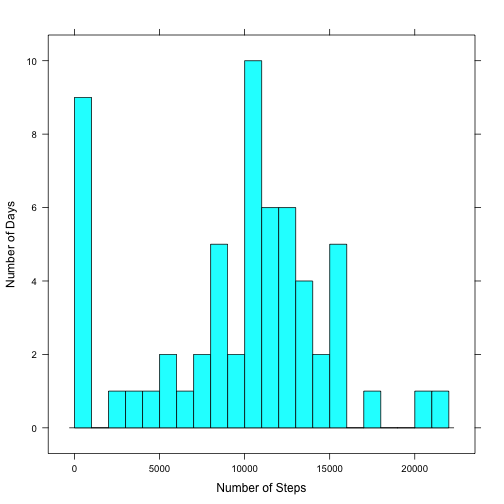
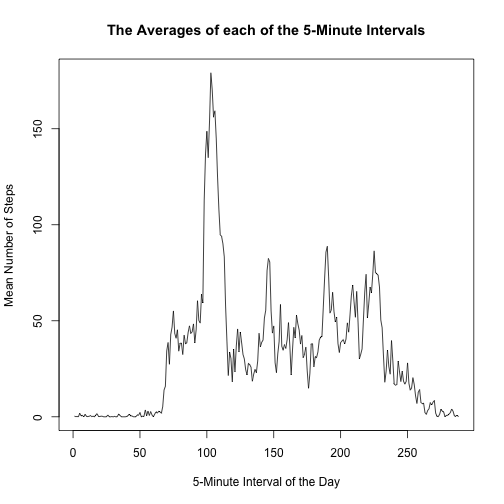
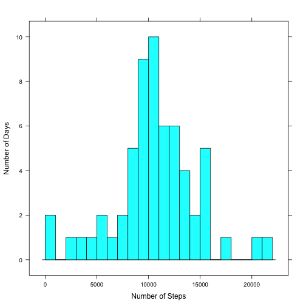
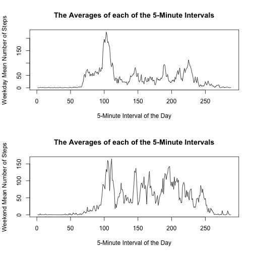

 # Results from a Personal Activity Monitor

## Introduction:
Data was collected from a personal activity monitoring device which collected data at 5 minute intervals. This data collection is from one individual and was collected for two months. The data consists of 3 columns and 17568 rows. The columns contain the number of steps, the date of the measurement, and the number of the 5-minute interval of that day in which the steps were taken. There are 288 5-minute intervals in 24 hours. Some values are missing and NA is substitued for the value.


The first step is to compute the number of steps taken each day by adding the number of steps in each interval for that day. So there are 288 numbers to add up for each day. Some of the numbers are missing and NA is substitued for that number. These are skipped. 
Then the next step is to compute the mean number of steps taken per day.
Next we compute the median of the steps taken per day.


```r
setwd("/Users/carollawrence/Coursera/DataScience/ReproResearch/Project1")
library(plyr)
PAM <- read.csv("./data/activity.csv")
head(PAM)
```

```
##   steps       date interval
## 1    NA 2012-10-01        0
## 2    NA 2012-10-01        5
## 3    NA 2012-10-01       10
## 4    NA 2012-10-01       15
## 5    NA 2012-10-01       20
## 6    NA 2012-10-01       25
```

```r
nrow(PAM)
```

```
## [1] 17568
```

```r
summary.data.frame(PAM)
```

```
##      steps                date          interval     
##  Min.   :  0.00   2012-10-01:  288   Min.   :   0.0  
##  1st Qu.:  0.00   2012-10-02:  288   1st Qu.: 588.8  
##  Median :  0.00   2012-10-03:  288   Median :1177.5  
##  Mean   : 37.38   2012-10-04:  288   Mean   :1177.5  
##  3rd Qu.: 12.00   2012-10-05:  288   3rd Qu.:1766.2  
##  Max.   :806.00   2012-10-06:  288   Max.   :2355.0  
##  NA's   :2304     (Other)   :15840
```

```r
library(plyr)
PAM <- read.csv("./data/activity.csv")
head(PAM)
```

```
##   steps       date interval
## 1    NA 2012-10-01        0
## 2    NA 2012-10-01        5
## 3    NA 2012-10-01       10
## 4    NA 2012-10-01       15
## 5    NA 2012-10-01       20
## 6    NA 2012-10-01       25
```

```r
date = as.Date(PAM[1,2])
#There are 288 5-minute intervals in each day
totalsOrig <- rep(0,60)
steps <- c()
k = 0
days = 0
for(j in 1:nrow(PAM)){
  if(date == as.Date(PAM[j,2])) { 
    if( !is.na(PAM[j,1]) ){
      totalsOrig[k] = totalsOrig[k] + PAM[j,1];}
  }
  else {
    date = as.Date(PAM[j,2])
    k = k + 1
    days = days + 1
  }
}
print(paste("The total number of steps taken each day for",days, "days."))
```

```
## [1] "The total number of steps taken each day for 60 days."
```

```r
print(totalsOrig)
```

```
##  [1]   126 11352 12069 13294 15420 11015     0 12811  9866 10304 17382
## [12] 12426 15098 10139 15084 13452 10056 11829 10395  8821 13450  8918
## [23]  8355  2492  6778 10119 11458  5018  9819 15414     0 10600 10571
## [34]     0 10439  8334 12883  3219     0     0 12608 10765  7336     0
## [45]    41  5441 14339 15110  8841  4472 12787 20427 21194 14478 11834
## [56] 11162 13646 10183  7047     0
```

```r
print(paste("Mean Number of Steps Per Day - ",mean(totalsOrig)))
```

```
## [1] "Mean Number of Steps Per Day -  9508.61666666667"
```

```r
print(paste("Median Number of Steps Per Day - ",median(totalsOrig)))
```

```
## [1] "Median Number of Steps Per Day -  10417"
```
Now we graph a histogram of the number of steps taken each day.

```r
library(lattice)
histogram( ~ totalsOrig, type = "count", breaks = 30, xlab = "Number of Steps", ylab = "Number of Days")
```

 
Make a time series plot (i.e. type = "l") of the 5-minute interval (x-axis) and the average number of steps taken, averaged across all days (y-axis)

Which 5-minute interval, on average across all the days in the dataset, contains the maximum number of steps?

```r
library(plyr)
PAM <- read.csv("./data/activity.csv")

date = as.Date(PAM[1,2])
#There are 288 5-minute intervals in each day
totals <- rep.int(0,288)
k = 1
days = 1
for(j in 1:nrow(PAM)){
  if(date == as.Date(PAM[j,2])) { 
    if( !is.na(PAM[j,1]) ){
      totals[k] = totals[k] + PAM[j,1]; k = k + 1}
    else {
      k = k + 1
    }
  }
  else {
    date = as.Date(PAM[j,2])
    k = 1
    days = days + 1
  }
}

means <- c()
maximum = 0
for(i in 1:288){
  m = totals[i]/days
  means <- c(means,m)
  if(m > maximum){
    maximum = m
    maxtime = i
  }
}
plot(means,type="l",ylab = "Mean Number of Steps",xlab = "5-Minute Interval of the Day",main ="The Averages of each of the 5-Minute Intervals")
```

 

```r
print(paste("Maximum number of steps in a 5-minute interval",maximum))
```

```
## [1] "Maximum number of steps in a 5-minute interval 179.131147540984"
```

```r
print(paste("5-minute interval in which the maximum occured",maxtime))
```

```
## [1] "5-minute interval in which the maximum occured 103"
```
Note that there are a number of days/intervals where there are missing values (coded as NA). The presence of missing days may introduce bias into some calculations or summaries of the data.

Calculate and report the total number of missing values in the dataset (i.e. the total number of rows with NAs)

```r
total = 0
for(j in 1:nrow(PAM)){
    if( is.na(PAM[j,1]) ){
      total = total + 1
    }
}
print(paste("The total number of NA's in the original dataset is",total))
```

```
## [1] "The total number of NA's in the original dataset is 2304"
```
Devise a strategy for filling in all of the missing values in the dataset. The strategy does not need to be sophisticated. For example, you could use the mean/median for that day, or the mean for that 5-minute interval, etc.
Create a new dataset that is equal to the original dataset but with the missing data filled in.

Replace the NA's with the mean of the 5-minute interval rounded to the nearest integer.

```r
total = 0
newData <- PAM
k = 1
for(j in 1:nrow(PAM)){
    if( is.na(PAM[j,1]) ){
      total = total + 1
      newData[j,1] = round(means[k])
    }
    k = k + 1
    if( k == 289) k = 1
}
```

Make a histogram of the total number of steps taken each day and calculate and report the mean and median total number of steps taken per day. Do these values differ from the estimates from the first part of the assignment? What is the impact of imputing missing data on the estimates of the total daily number of steps?


```r
date = as.Date(newData[1,2])
totalsNew <- rep(0,60)
steps <- c()
k = 0
days = 0
for(j in 1:nrow(newData)){
  if(date == as.Date(newData[j,2])) { 
    if( !is.na(newData[j,1]) ){
      totalsNew[k] = totalsNew[k] + newData[j,1];}
  }
  else {
    date = as.Date(newData[j,2])
    k = k + 1
    days = days + 1
  }
}
histogram( ~ totalsNew, type = "count", breaks = 30, xlab = "Number of Steps", ylab = "Number of Days")
```

 

```r
print(paste("The total number of steps taken each day for",days, "days."))
```

```
## [1] "The total number of steps taken each day for 60 days."
```

```r
print(totalsNew)
```

```
##  [1]   126 11352 12069 13294 15420 11015  9351 12811  9866 10304 17382
## [12] 12426 15098 10139 15084 13452 10056 11829 10395  8821 13450  8918
## [23]  8355  2492  6778 10119 11458  5018  9819 15414  9351 10600 10571
## [34]  9351 10439  8334 12883  3219  9351  9351 12608 10765  7336  9351
## [45]    41  5441 14339 15110  8841  4472 12787 20427 21194 14478 11834
## [56] 11162 13646 10183  7047  9351
```

```r
print(paste("Mean Number of Steps Per Day - ",mean(totalsNew)))
```

```
## [1] "Mean Number of Steps Per Day -  10599.5666666667"
```

```r
print(paste("Median Number of Steps Per Day - ",median(totalsNew)))
```

```
## [1] "Median Number of Steps Per Day -  10417"
```

```r
print(totalsOrig)
```

```
##  [1]   126 11352 12069 13294 15420 11015     0 12811  9866 10304 17382
## [12] 12426 15098 10139 15084 13452 10056 11829 10395  8821 13450  8918
## [23]  8355  2492  6778 10119 11458  5018  9819 15414     0 10600 10571
## [34]     0 10439  8334 12883  3219     0     0 12608 10765  7336     0
## [45]    41  5441 14339 15110  8841  4472 12787 20427 21194 14478 11834
## [56] 11162 13646 10183  7047     0
```

```r
print(paste("Mean Number of Steps Per Day - ",mean(totalsOrig)))
```

```
## [1] "Mean Number of Steps Per Day -  9508.61666666667"
```

```r
print(paste("Median Number of Steps Per Day - ",median(totalsOrig)))
```

```
## [1] "Median Number of Steps Per Day -  10417"
```
It seems that only the 5-minute intervals which contained NA were changed by this method. The mean increased from 9508.62 to 10582.53 but the median remained the same at 10417.


Create a new factor variable in the dataset with two levels – “weekday” and “weekend” indicating whether a given date is a weekday or weekend day.


```r
x <- weekdays(as.Date(newData$date))
y <- c()
for(i in 1:length(x)){
  if(x[i] %in% c("Monday","Tuesday","Wednesday","Thursday","Friday")){
    y <- c(y,"weekday")
  }
  else{
    y <- c(y,"weekend")
  }
}
newData <- cbind(newData,y)
```
Make a panel plot containing a time series plot (i.e. type = "l") of the 5-minute interval (x-axis) and the average number of steps taken, averaged across all weekday days or weekend days (y-axis). See the README file in the GitHub repository to see an example of what this plot should look like using simulated data.


```r
date = as.Date(newData[1,2])
#There are 288 5-minute intervals in each day
weekday_totals <- rep.int(0,288)
weekend_totals <- rep.int(0,288)
k = 1
wd = 0; we = 0;
if(newData[1,4] == "weekday"){
  weekdays = 1; weekends = 0
}else{
  weekdays = 0; weekends = 1
}
for(j in 1:nrow(newData)){
  if(date == as.Date(newData[j,2])){
    if(newData[j,4] == "weekday") { 
      wd = wd + 1
      weekday_totals[k] = weekday_totals[k] + newData[j,1]
    }
    if(newData[j,4] == "weekend"){
      we = we + 1
      weekend_totals[k] = weekend_totals[k] + newData[j,1]
    } 
    k = k + 1
  }else {
    date = as.Date(newData[j,2])
    k = 1
    if(newData[j,4] == "weekday")
      weekdays = weekdays + 1
    else
      weekends = weekends + 1
  }
}
print(paste("Weekdays",weekdays,"Weekends",weekends))
```

```
## [1] "Weekdays 45 Weekends 16"
```

```r
weekday_means <- c()
for(i in 1:288){
  m = weekday_totals[i]/weekdays
  weekday_means <- c(weekday_means,m)
}
weekend_means <- c()
for(i in 1:288){
  m = weekend_totals[i]/weekends
  weekend_means <- c(weekend_means,m)
}

par(mfrow = c(2,1))
plot(weekday_means,type="l",ylab = "Weekday Mean Number of Steps",xlab = "5-Minute Interval of the Day",main ="The Averages of each of the 5-Minute Intervals")
plot(weekend_means,type="l",ylab = "Weekend Mean Number of Steps",xlab = "5-Minute Interval of the Day",main ="The Averages of each of the 5-Minute Intervals")
```

 
